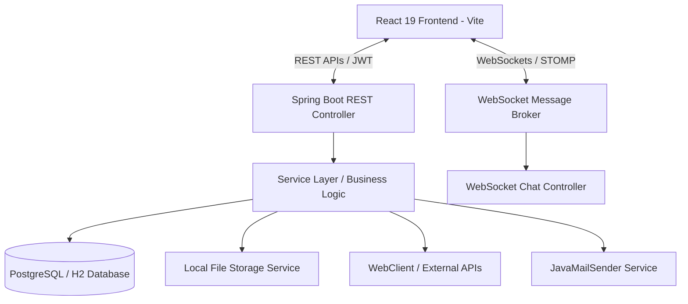

# 🌌 Fast-Z: Premium Full-Stack Social Media Platform

Welcome to **Fast-Z**, a next-generation, high-performance social media platform built using a modern **Spring Boot 3 (Java 21)** backend and a blazing-fast **Vite + React 19** frontend.

Designed with a premium glassmorphic UI, Fast-Z supports secure authentication, real-time instant messaging via WebSockets, file uploads, transactional mail alerts, and a fully interactive user relation system (following, unfollowing, and private account approvals).

---

## 🎨 Design & Aesthetic System
Fast-Z features an immersive, state-of-the-art dark-mode dashboard tailored for visual excellence:
- **Glassmorphic Interfaces**: Clean cards with frosted-glass backing, custom borders, and deep shadow hierarchies.
- **Deep Space Palette**: Primary background of deep slate (`#0f172a`), accented with electric violet, hot pink gradients, and clean white-opacity borders.
- **Fluid Animations**: Smooth page transitions and micro-animations built using **Framer Motion** for a native-app feel.

---

## 🏗️ System Architecture
Fast-Z is architected with a decoupled full-stack design, separating server-side business logic and real-time streams from client-side state.



---

## 🚀 Key Features

### 1. Robust Security & User Verification
- **JWT Authorization**: Custom security filter intercepting stateless HTTP requests and extracting token payloads.
- **BCrypt Password Hashing**: Zero plain-text password storage.
- **Email Verification Flow**: Upon registration, users receive verification tokens via a structured email. Accounts remain in a `PENDING` state until validated.
- **Private Profiles**: Users can toggle account privacy (`isPrivate`). When enabled, other users must request to follow, and the host can accept or decline follow requests.

### 2. Social Interactions & Feed
- **Multipart Media Uploads**: Custom file storage engine storing uploaded images to the filesystem (`uploads/` directory) and mapping them back through a Spring Boot resource handler.
- **Social Feed**: Paginated feed retrieval showing posts from users you follow.
- **Likes & Comments**: Fully reactive model relations ensuring instant feedback when liking or replying to posts.

### 3. Real-Time Chat System
- **WebSocket STOMP Broker**: Built-in simple broker mapping messages to target private user queues.
- **Point-to-Point Messaging**: High-performance socket pipelines using SockJS to send instant direct messages (`/app/chat`) and dynamically updating active client chat screens (`/user/{recipientId}/queue/messages`).

---

## 📂 Codebase Breakdown

### 🖥️ Backend Structure (`Social-Media-Platform`)
The Java backend follows clean clean-code principles and separation of concerns:
```
Social-Media-Platform/src/main/java/com/example/Social/Media/Platform/
├── SocialMediaPlatformApplication.java   # App Entrypoint
├── config/                               # Infrastructure Configurations
│   ├── HttpSecurityConfig.java           # Security & CORS filters
│   ├── SecurityConfig.java               # Password Encoders & Managers
│   ├── WebConfig.java                    # Static files & resource handlers
│   └── WebSocketConfig.java              # STOMP WebSocket configurations
├── controller/                           # REST Endpoint Handlers
│   ├── AuthController.java               # Register, Login, Verification
│   ├── ChatController.java               # WebSocket message router
│   ├── CommentController.java            # Comment actions
│   ├── LikeController.java               # Like toggles
│   ├── PostController.java               # Post CRUD & Media upload
│   └── UserController.java               # User relationship operations
├── model/                                # JPA Entity Models
│   ├── User.java & UserInfo.java         # User account & detailed profile
│   ├── Post.java & Comment.java          # Posts & replies
│   ├── Like.java                         # Like relations
│   ├── Follow.java                       # Connections & FollowStatus
│   └── Message.java                      # Direct message models
├── dto/                                  # Data Transfer Objects
├── repository/                           # JPA Spring Data Repositories
├── security/                             # Custom JWT Request Filters
└── service/                              # Core Business Logic
    ├── AuthService.java                  # User Registration & JWT issue
    ├── EmailService.java                 # Verification email engine
    ├── ExternalApiService.java           # WebClient REST calling service
    └── FileStorageService.java           # Physical multipart file storage
```

### ⚛️ Frontend Structure (`frontend`)
Built using standard React components, styled elegantly with custom CSS and Tailwind layers:
```
frontend/
├── src/
│   ├── main.jsx                          # React Render Entrypoint
│   ├── App.jsx                           # Core Router & Protected Routes
│   ├── index.css & App.css               # Design system & Glassmorphic tokens
│   ├── components/                       # Reusable UI Blocks
│   │   ├── Navbar.jsx                    # Top search, navigation & actions
│   │   ├── Sidebar.jsx                   # Main application navigation menu
│   │   └── PostCard.jsx                  # Rich post renderer (likes, comments, media)
│   ├── pages/                            # Page Layout Screens
│   │   ├── Login.jsx                     # High-fidelity Authentication Screen
│   │   ├── Feed.jsx                      # Active timeline & Post Creation Area
│   │   └── Profile.jsx                   # User Bio, Stats & Actions
│   └── services/                         # API Access Layer
│       └── api.js                        # Axios setup with JWT request interceptors
├── package.json                          # Node dependencies & run scripts
└── vite.config.js                        # Vite dev server configurations
```

---

## 🛠️ Tech Stack Reference
| Tier | Technology | Description |
| :--- | :--- | :--- |
| **Backend Core** | Java 21 | Modern LTS Java runtime features |
| **Backend Framework** | Spring Boot 3.4.1 | Automated DI, JPA, and web endpoints |
| **Security** | Spring Security 6 & JJWT | Authentication, authorization, and password encoding |
| **Real-time Engine** | Spring WebSocket + STOMP | Socket channel handling and message broker |
| **Client Core** | React 19 | Declarative user interfaces & state trees |
| **Client Router** | React Router DOM 7 | Path mapping and protected authorization routes |
| **Client Build** | Vite | Ultra-fast module reloading and bundling |
| **Styling** | TailwindCSS & Framer Motion | Frosted layouts and micro-interactions |

---

## 🏁 Setup and Installation

### Prerequisites
- **Java JDK 21** installed and configured in your `PATH`.
- **Node.js** (v18 or higher) & **npm** installed.
- **Maven** (configured, or use the included `mvnw` wrapper).

---

### Step 1: Run the Backend
1. Open a terminal in the `/Social-Media-Platform` directory.
2. Build the project and run the server using Maven:
   ```bash
   ./mvnw spring-boot:run
   ```
3. The server will start up at `http://localhost:8080`.
4. The local development H2 database console is accessible at `http://localhost:8080/h2-console` (Credentials are configured in `application.properties`).

---

### Step 2: Run the Frontend
1. Open a separate terminal in the `/frontend` directory.
2. Install npm package dependencies:
   ```bash
   npm install
   ```
3. Boot up the Vite dev server:
   ```bash
   npm run dev
   ```
4. Click or navigate to `http://localhost:5173` to explore Fast-Z!

---

## 📡 API Reference Guides

### 🔑 Authentication Endpoints
- `POST /api/auth/register` - Registers a new account. Sends email verification token.
- `POST /api/auth/login` - Authenticates user credentials. Returns JWT session token.
- `GET /api/auth/verify?token=...` - Validates the verification link token and activates the account.

### 📝 Post & Feed Endpoints
- `POST /api/posts` - Creates a new post (Supports `multipart/form-data` with an image file).
- `GET /api/posts` - Retrieves all posts, or filters by `userId` (Paginated).
- `DELETE /api/posts/{id}` - Deletes a post by its ID.
- `POST /api/posts/{id}/like` - Likes or unlikes the specified post.

### 👥 User Relationships
- `POST /api/users/{followedId}/follow` - Sends follow request or follows user.
- `DELETE /api/users/{followedId}/unfollow` - Unfollows user.
- `POST /api/users/{followerId}/accept` - Confirms a pending follow request.

---

## 🤝 Project Contribution
1. Fork the repository.
2. Create a clean feature branch (`git checkout -b feature/NewFeature`).
3. Commit your modifications (`git commit -m "Add new features"`).
4. Push the branch (`git push origin feature/NewFeature`).
5. Open a Pull Request!
